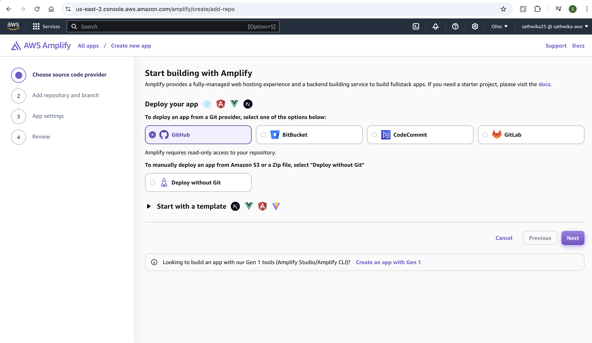
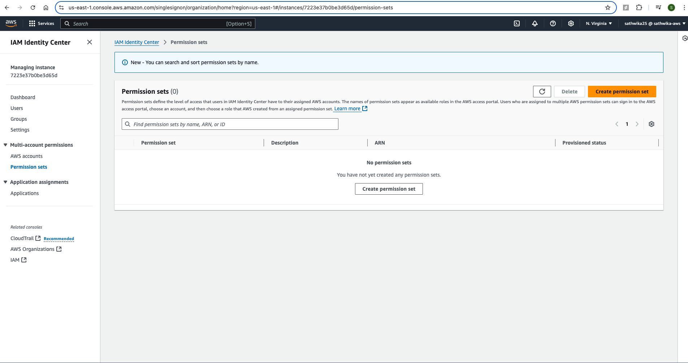

vite
# React-To-Do-App-with-Amplify-Gen-2
Follow the steps below to deploy and develop a To-Do app using the [Amplify Vite React template](https://github.com/aws-samples/amplify-vite-react-template).

## 1. Create a GitHub Repository
Use the template from [AWS Amplify Vite React template](https://github.com/aws-samples/amplify-vite-react-template) and create a repository in your GitHub account.

## 2. Deploy to AWS Amplify
1. Deploy the app to AWS Amplify by choosing GitHub as the deployment option:

2. Authorize Amplify to access your GitHub:

3. Select the desired GitHub repository and click **Next**:

4. Keep the build settings as default and click **Next**:

5. Review your settings and click **Save and Deploy**.


7. Wait for the deployment to complete.

8. Once the deployment is complete, click on the domain link to navigate to the To-Do app.


## 3. Interact with the To-Do App
1. Add todos to the app.

2. Above the deployed app, you'll see the branch name (e.g., `main`). Click on it to go to **Deployed Backend Resources**.

3. You can see tables created automatically in DynamoDB.

4. The **Data Manager** section under **Data** will display todos added.

5. You can also see GraphQL queries under the **API Playground**.

6. The front-end part of the app is available under **Hosting**.

7. For backend operations, go to the specific branch (e.g., `main`).

## 4. Clone the Repository Locally
To modify the code and push updates directly, clone the repository using:


git clone https://github.com/sathwika05/amplify-vite-react-template.git

## 5. Set Up the Project Locally
Navigate to the folder containing the src directory.
Run the following command to install dependencies:

npm install

If the command results in errors, check your Node version or follow suggestions in the command prompt.


Once installed, run the app locally:

npm run dev


Open the app in your browser.

You might encounter an error saying that amplify_outputs.json is missing.


## 6. Obtain amplify_outputs.json
The amplify_outputs.json file contains essential backend details, including endpoints, API keys, and authentication info.

1. Go to the AWS Amplify console.
2. Click on the main branch and go to the Deployed Backend Resources tab.
3. On the right side, click Download amplify_outputs.json.

4. Place this file at the same level as your src folder.

5. Refresh the page to connect the app with the backend resources.

## 7. Add Todos and Test the App
1. Add a new todo and verify it appears both in the UI and in the Amplify Console (DynamoDB).


2. Make changes to the front end to implement deletion and login/logout features.
8. Implement Deletion and Login/Logout
Delete Todo
In App.tsx, add the following deleteTodo function:

'''tsx

function deleteTodo(id: string) {
client.models.Todo.delete({ id });
}
Add the delete functionality to the <li> element:

'''tsx

onClick={() => deleteTodo(todo.id)} in the list tag of return


### Implement Login UI
The starter application already has pre-configured authentication.
In src/main.tsx, import the Authenticator component:
'''tsx

import { Authenticator } from '@aws-amplify/ui-react';
import '@aws-amplify/ui-react/styles.css';
Wrap the App component in Authenticator:


'''tsx

<Authenticator>
<App />
</Authenticator>
Sign Out Button
In App.tsx, import the useAuthenticator hook and add a sign-out button:

'''tsx

import { useAuthenticator } from '@aws-amplify/ui-react';

const { signOut } = useAuthenticator();

<button onClick={signOut}>Sign out</button>
Your App.tsx should look like this:

```tsx

import { useEffect, useState } from "react";
import { useAuthenticator } from '@aws-amplify/ui-react';
import type { Schema } from "../amplify/data/resource";
import { generateClient } from "aws-amplify/data";

const client = generateClient<Schema>();

function App() {
const { signOut } = useAuthenticator();
const [todos, setTodos] = useState<Array<Schema["Todo"]["type"]>>([]);

useEffect(() => {
client.models.Todo.observeQuery().subscribe({
next: (data) => setTodos([...data.items]),
});
}, []);

function createTodo() {
client.models.Todo.create({ content: window.prompt("Todo content") });
}

function deleteTodo(id: string) {
client.models.Todo.delete({ id })
}

return (
<main>
<h1>My todos</h1>
<button onClick={createTodo}>+ new</button>
<ul>
{todos.map((todo) => (
<li
onClick={() => deleteTodo(todo.id)}
key={todo.id}>
{todo.content}</li>
))}
</ul>
<div>
🥳 App successfully hosted. Try creating a new todo.
<br />
<a href="https://docs.amplify.aws/react/start/quickstart/#make-frontend-updates">
Review next step of this tutorial.
</a>
</div>
<button onClick={signOut}>Sign out</button>
</main>
);
}

export default App;
```
## 9. Testing the App

The vs code automatically detects the changes and now we see the changes on the UI with login screen:


Create an account with valid email address as it send the code to verify

Verify with code

Then you will be logged in to your todos list

We implemented delete too so click on item to delete it. After deletion:


You will be able to log in, add todos, delete them, and sign out.

## 10. Push Changes to GitHub

After making changes, push the updates to GitHub:
```
git commit -am 'Added delete functionality and authenticator'
git push
```
This will trigger a new deployment in AWS Amplify.


## 11. Set Up a Sandbox for Multiple Environments

To make use of the same code version in different environments without affecting each other:

Run the following command to create a sandbox:
```
npx ampx sandbox
```

If you encounter any issues, follow the steps to configure AWS for local development:

Set up temporary credentials with IAM Identity Center and AWS Organizations.
(i) Configure the appropriate permissions for Amplify.

(ii) Add users and assign permissions for access.

(iii) After configuring, you can use the sandbox environment without affecting the deployed version.

Enable with AWS Organizations and continue. It now navigates to a dashboard


You can go to aws organizations service and see there is a root and the user


Go to services tab in aws organisation and make sure SSO is enabled


Currently we don’t have any users or permission sets in IAM Identity Center
Go to permission sets and click on Create permission set on right

We will have two options Predefined permission set and Custom permission set. Click on custom permission set.


Expand AWS managed policies and filter for amplify

The one you want is AmplifyBackendDeployFullAccess and click next


Specify permission details and say next


Review and create


Now go to IAM Identity Center and add the users going to Users who could use the above permissions created


Review and submit


Then go to user and click on the above created amplify-admin user and then click on send email verification link


Verify the email.


Select the MFA and click next


Scan the QR code on your phone and get the code


Final Step is to change the password


Now we have to interact with the resources in that account from my local dev environment using aws cli
Make sure to check AWS cli is installed.You can check using the following command:
$aws –version

If not there install it and run the following commands:
$aws configure sso


If you inspect ~/.aws/config, you should now see the SSO profile:


Now you are ready to use this AWS profile with AWS Amplify. Open your Amplify project and start the sandbox. If you have multiple local profiles or named your profile something other than default, you can specify a profile with --profile.
```
$npx ampx sandbox

OR

$npx ampx sandbox --profile <profile-name>

```

The output of $npx ampx sandbox command in terminal


On the amplify console, go to Manage sandboxes on right


You see your app is deployed


If you notice amplify_ouputs.json now it points to the sandbox details in the cloud instead of production branch


## 12. Test Per-User Authorization
Make changes to the resource.ts to implement per-user authorization:

'''tsx

const schema = a.schema({
Todo: a.model({
content: a.string(),
}).authorization(allow => [allow.owner()]),
});

export type Schema = ClientSchema<typeof schema>;

export const data = defineData({
schema,
authorizationModes: {
defaultAuthorizationMode: "userPool",
apiKeyAuthorizationMode: {
expiresInDays: 30,
},
},
});
In App.tsx, update the UI to display user-specific todos:

'''tsx

<h1>{user?.signInDetails?.loginId}'s todos</h1>

Now create a new account with different email account

Now you see a new todo screen you don’t see the old user todos as it is a new user.


Now you cannot use the old user account as this is a sandbox you have to create again.

## 13. Push Changes and Test
Push your changes to GitHub and test the app in the cloud.

## 14. Clean Up
Once testing is complete, delete the sandbox and app resources:
1. Go to Manage Sandbox and delete the sandbox.
2. Go to App Settings and delete the app.


